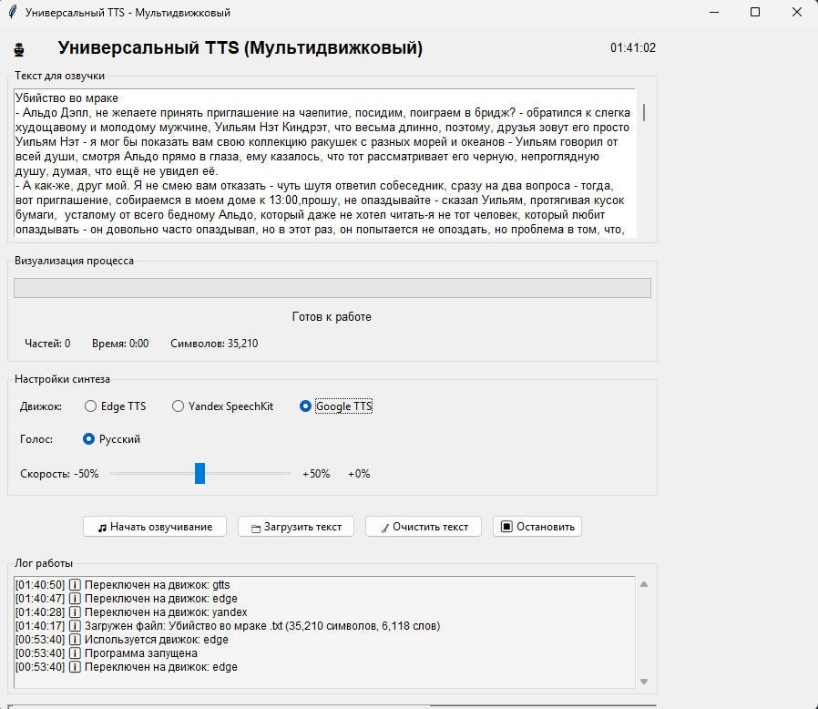
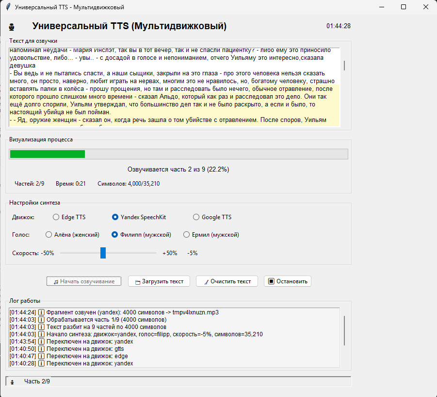
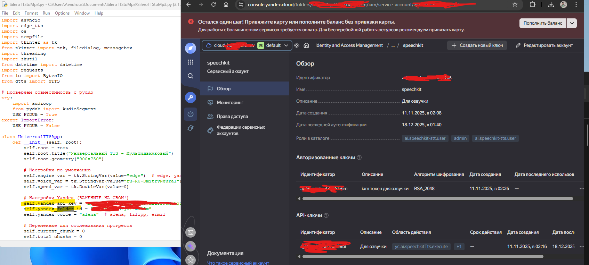

# 🎙️ Универсальный TTS Синтезатор (Мультидвижковый)

[](https://www.python.org/)
[](LICENSE)
[](https://github.com/Aendrous/SileroTTStoMp3)

Программа с графическим интерфейсом для синтеза речи из текста с использованием нескольких движков TTS. Поддерживает Edge TTS, Yandex SpeechKit и Google TTS.

## 📸 Скриншоты

### Главное окно программы


### Процесс синтеза


### Настройки Yandex SpeechKit


## ✨ Возможности

- **Мультидвижковая архитектура**:
  - ✅ Edge TTS (Microsoft) — высокое качество, не требует ключей
  - ✅ Yandex SpeechKit — премиум голоса, лучшее качество для русского
  - ✅ Google TTS — простой и бесплатный
- **Графический интерфейс** на tkinter
- **Визуализация процесса**:
  - Прогресс-бар с процентом выполнения
  - Подсветка текущего обрабатываемого фрагмента
  - Детальная статистика (время, символы, части)
- **Поддержка длинных текстов** — автоматическое разбиение на части
- **Лог работы** с цветовой маркировкой сообщений
- **Экспорт в MP3** — сохранение результата в один файл

## 📦 Установка и запуск

### 1. Требования
- Python 3.8 или выше
- Установленные зависимости (см. ниже)

### 2. Установка зависимостей
```bash
# Клонируйте репозиторий
git clone https://github.com/Aendrous/SileroTTStoMp3.git
cd SileroTTStoMp3

# Установите зависимости
pip install -r requirements.txt
